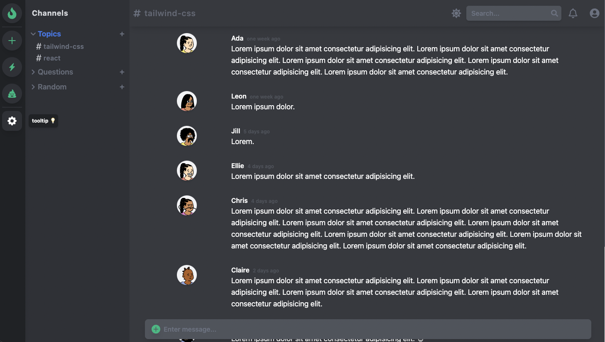

## Discord-Inspired Dashboard with React/Tailwind CSS

- Watch the [Tailwind Basics Tutorial](https://youtu.be/pfaSUYaSgRo) on YouTube
- [Live demo](https://tailwind-dashboard-demo.netlify.app/)
- [Original Repo from Fireship.io](https://github.com/fireship-io/tailwind-dashboard)

#### Dark mode

#### Light mode

